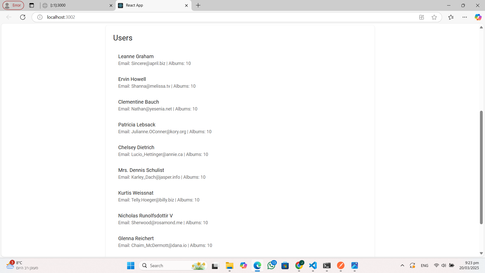

# AstonishGallery

AstonishGallery is a full-stack mini-site designed to showcase users, albums, and images in a beautiful, animated gallery format. The application is built with:
- **NestJS** (backend)
- **React** (frontend)
- **Material UI** (styling and design consistency)
- **CSS Variables** (for a cohesive look and feel)


> **Note**: Replace `./screenshots/astonishgallery-overview.png` with the actual path or URL to your screenshot file.

---

## Table of Contents

1. [Overview](#overview)
2. [Features](#features)
3. [Screenshots](#screenshots)
4. [Getting Started](#getting-started)
   - [Backend Setup (NestJS)](#backend-setup-nestjs)
   - [Frontend Setup (React)](#frontend-setup-react)
5. [Usage](#usage)
6. [Testing with Postman](#testing-with-postman)
7. [Technologies Used](#technologies-used)
8. [Contributing](#contributing)
9. [License](#license)

---

## Overview

AstonishGallery provides an intuitive interface for managing:
- **Users** (with their album counts)
- **Albums** (with covers in a gallery layout)
- **Images** (displayed in a carousel)

Users can **create**, **edit**, and **delete** users, albums, and images. The application also features:
- **Material UI** for a polished design system
- **CSS Variables** to ensure a consistent theme
- **Animated transitions** (Grow, Fade, etc.) for a professional look

---

## Features

1. **Display a list of users and the number of albums each user has**  
   - Shown in the main page under “Users.”
2. **Enable viewing albums in a gallery format**  
   - Each album shows a cover (the first image or a placeholder).
3. **Implement a carousel feature for images**  
   - Allows viewing all images in an album.
4. **Use CSS Variables**  
   - E.g., `--primary-color`, `--card-radius`, etc. for cohesive styling.
5. **Adopt Material UI**  
   - For a streamlined development process and design consistency.
6. **Provide CRUD operations**  
   - Add, edit, delete users, albums, and images from the UI.

---

## Screenshots

### 1. Main Page: Creating a New User


> **Description**: A form at the top lets you add a new user. On successful creation, a success message appears (green alert).

### 2. User List


> **Description**: Displays each user with their email and the number of albums. Clicking on a user loads their albums below.

### 3. Albums for a Selected User


> **Description**: A gallery of album cards, each showing a placeholder or first image as cover. You can add a new album with the form above.

### 4. Images in an Album


> **Description**: Shows the images for the selected album in a card layout, plus a form to add a new image.

### 5. Carousel for Viewing Images


> **Description**: A simple carousel with left/right arrows for navigating images.

---

## Getting Started

### Backend Setup (NestJS)

1. **Install Dependencies**:
   ```bash
   cd backend
   npm install
2. **Enable CORS in `src/main.ts`**:
   ```typescript
   app.enableCors();
3. **Run the Server**:
   ```bash
   npm run start:dev
   
#### By default, the NestJS server listens on http://localhost:3000.

### Frontend Setup (React)
1. **Install Dependencies**:
   ```bash
   cd frontend
   npm install
2. **Start the Development Server**:
    ```bash
   npm start
#### The React app typically runs on http://localhost:3001 or 3002 (depending on conflicts).
3. **Open your browser to http://localhost:3001 (or the port displayed in the terminal).**

### Usage

1. **Create a New User**
   - Fill in the “Add New User” form and click **Create User**. A success alert appears if the operation succeeds.

2. **View Albums**
   - Select a user from the list. The albums for that user are displayed in a gallery format.

3. **Create/Edit/Delete Albums**
   - Add a new album using the “Add New Album” form.
   - For editing or deleting, you can add buttons (Edit/Delete) to each album card if desired.

4. **View Images**
   - Select an album to see its images.
   - The “Add New Image” form allows adding more images.
   - The carousel (ImageCarousel) displays images with left/right navigation.

### Testing with Postman

To verify or troubleshoot API endpoints, you can use Postman:

1. **Open Postman** and create a new request.
2. **Select the HTTP method** (GET, POST, PUT, DELETE).
3. **Set the URL** to your NestJS server endpoint, for example:
   - `GET http://localhost:3000/users`
   - `POST http://localhost:3000/users`
   - `GET http://localhost:3000/users/:id/albums`

4. For **POST/PUT requests**, add a JSON body. For example, creating a new user:
   ```json
   {
     "name": "Jane Doe",
     "email": "jane@example.com"
   }

5. **Send** the request and check the response/status code.

Description: Shows a GET http://localhost:3000/users request in Postman, returning a list of users with albums.

### Technologies Used

- **NestJS (TypeScript)** for the backend
- **React (TypeScript)** for the frontend
- **Material UI** for design system and components
- **CSS Variables** for consistent theming
- **Axios** for HTTP requests
- **MongoDB or local JSON** (depending on your setup) for data storage

### Contributing

1. **Fork the repository.**

2. **Create a new feature branch:**
   ```bash
   git checkout -b feature/your-feature

3. **Commit changes:**
   ```bash
   git commit -m "Add new feature"

4. **Push to your branch:**
   ```bash
   git push origin feature/your-feature
   
5. **Open a pull request.**

### License
This project is licensed under the MIT License. Feel free to use and adapt it for your own purposes.
